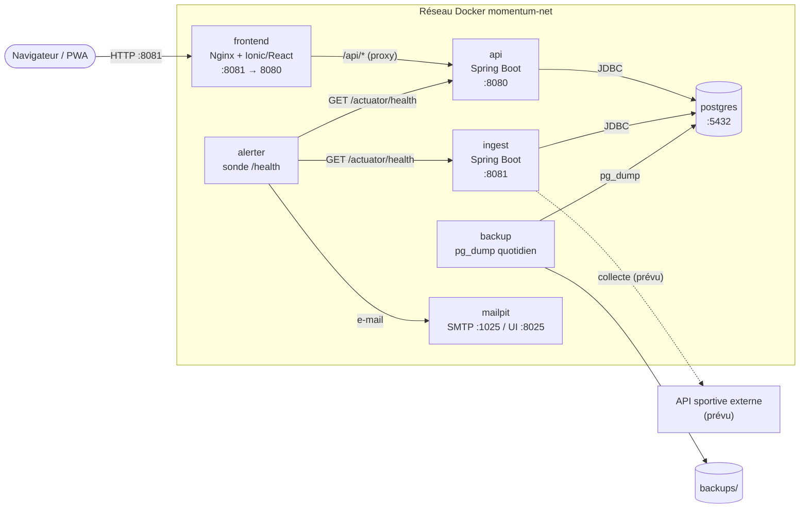
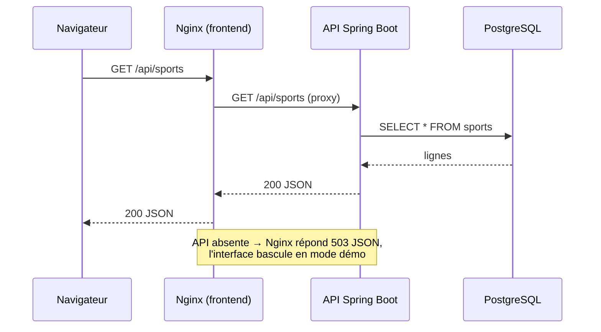

# Architecture Momentum

## Vue d'ensemble

## Composants

| Composant | Technologie | Rôle |
|-----------|-------------|------|
| `momentum-frontend` | Ionic 8, React, Vite, Nginx non privilégié | Interface accessible ; sert les fichiers statiques et relaie `/api/` vers l'API (même origine, pas de CORS) |
| `momentum-api` | Spring Boot 3.5, Java 21, Spring Security | API REST (`/api/health`, `/api/sports`), OpenAPI/Swagger |
| `momentum-ingest-api` | Spring Boot | Ingestion de données sportives (squelette) |
| `momentum-domain` | Bibliothèque JPA | Entités et dépôts partagés par `api` et `ingest` |
| `postgres` | PostgreSQL 18 | Base unique ; volume `postgres_data` |
| `backup` / `alerter` / `mailpit` | Shell + images officielles | Sauvegarde, alerte, boîte mail de test (voir `docs/ops/runbook.md`) |

## Flux d'une requête

## Décisions

- **Proxy `/api` plutôt que CORS** : une seule origine pour le navigateur ; CORS reste configuré
  (`CORS_ALLOWED_ORIGINS`) pour les appels directs.
- **Deux piles Compose, un réseau** : chaque dépôt se lance seul ; `momentum-net` les relie.
- **Configuration par variables d'environnement** (`.env`), aucun secret dans le code.
- **Sécurité par défaut** : toute route est authentifiée sauf liste blanche dans `SecurityConfig`.
- **Données sportives** : matchs et classements sont encore des données de démonstration côté frontend.

## Documentation de l'API

- Swagger UI : `http://localhost:8080/swagger-ui.html` (public).
- Spécification OpenAPI vivante : `http://localhost:8080/v3/api-docs`.
- Instantané versionné : [`docs/api/openapi.json`](../../momentum-backend/docs/api/openapi.json) (backend).

| Méthode | Route | Auth | Réponses |
|---------|-------|------|----------|
| GET | `/api/health` | publique | 200 `{status, service, timestamp}` |
| GET | `/actuator/health` | publique | 200 `{"status":"UP"}` |
| GET | `/api/sports` | publique | 200 liste de `{id, name, code, type, active}` |
| POST | `/api/sports` | HTTP Basic | 201 sport créé · 400 données invalides · 401 |